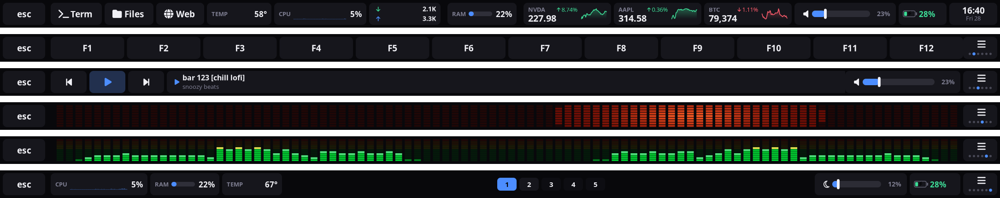
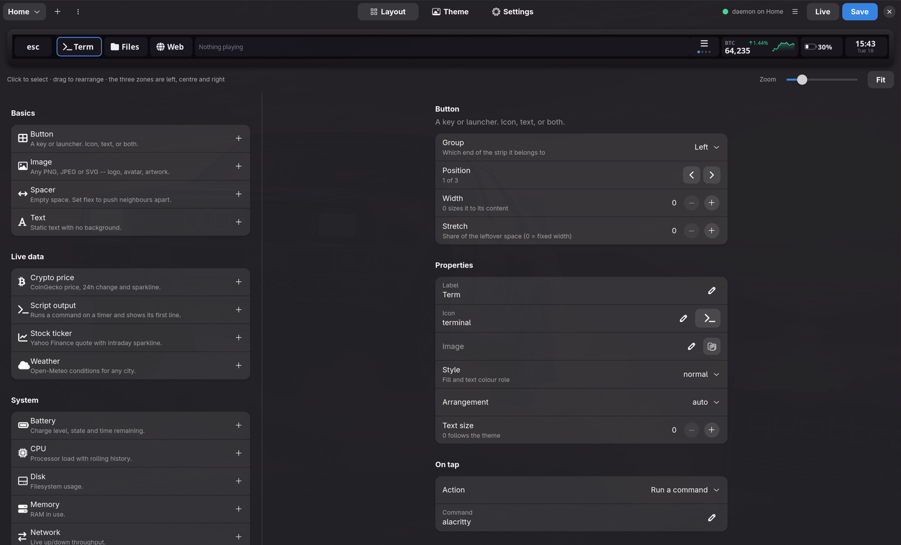
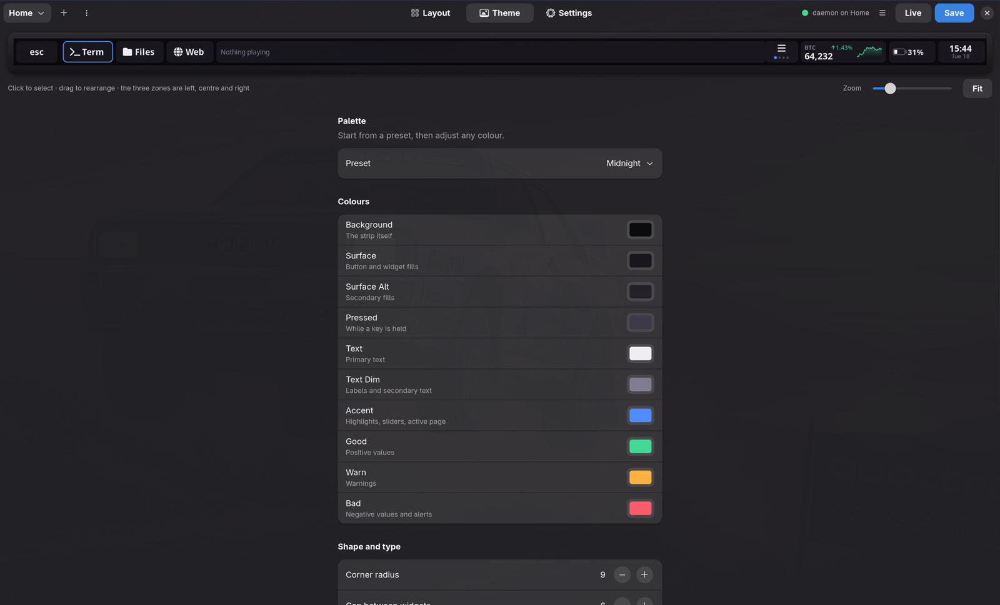
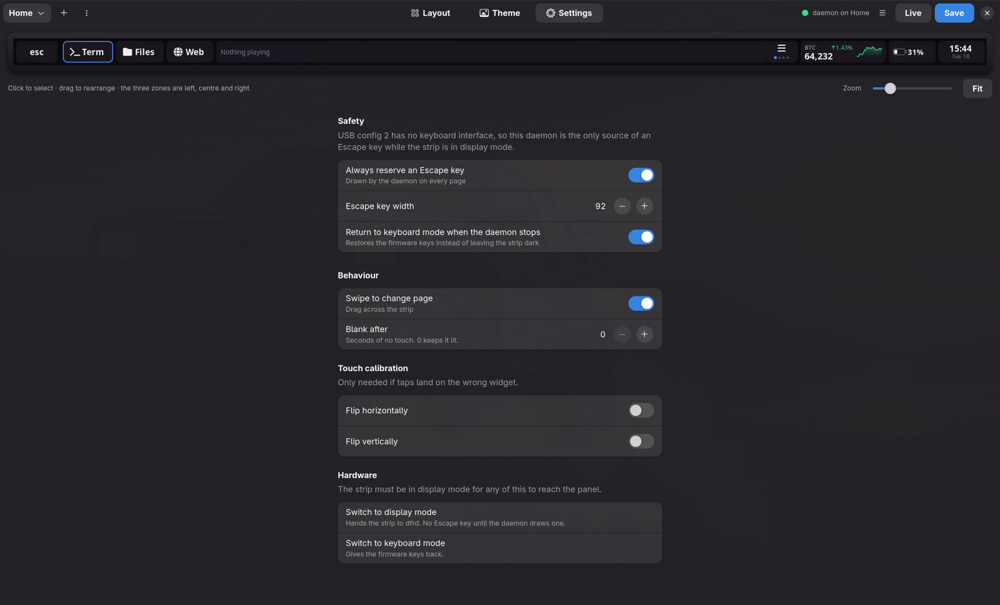

# Dfrd - MacLinux Touchbar

*The Apple T1 Touch Bar, and an app to design it.*

Turns the Touch Bar on a **MacBookPro13,3** (2016, T1/iBridge `05ac:8600`)
into a 2170×60 framebuffer you can put anything on — custom buttons, images,
and live widgets — plus a GTK4 designer that previews every change against the
same renderer the hardware uses.

```
dfr-editor        design it
dfrd              run it
dfrctl            drive it from scripts
```

The programs keep the short `dfr*` names throughout — `dfrd` is the daemon,
and `~/.config/dfrd/` is where its config lives.



*The four stock pages, captured from the running daemon with `dfrctl
screenshot`: launchers and a BTC ticker, the F-keys, media with a volume
slider, and system meters with Hyprland workspaces.*

## What you can put on the strip

| Category | Widgets |
|---|---|
| **Basics** | Button (icon, text, image, any key or command), Text, Image (PNG/JPEG/SVG), Spacer |
| **Live data** | KITT visualiser (audio spectrum), Crypto price (CoinGecko), Stock ticker (Yahoo Finance), Weather (Open-Meteo), Script output |
| **System** | CPU, Memory, Temperature, Disk, Network throughput, Battery |
| **Controls** | Volume slider, Brightness slider, Now playing (MPRIS), Workspaces (Hyprland) |
| **Navigation** | Page switcher, and a reserved Escape key |

Market and weather widgets need no API key. Anything not covered is a
**Script** widget: run a command on a timer and show its first line.

### KITT

The `kitt` page is the visualiser on its own, filling the strip.

It shows the spectrum of **what this machine is actually playing** — the
monitor of the default sink, so every application, post-volume, and nothing
from the microphone. It follows the default sink rather than a fixed device,
so moving output to headphones does not freeze it.

> Capture is `parec`, not `pw-record`, and the daemon checks where it landed.
> `pw-record --target <sink>.monitor` does not fail on a name it cannot
> resolve — it falls back to the default *capture* device, which is the
> built-in microphone. The visualiser still moves, because the microphone can
> hear the speakers, so nothing looks wrong while nothing about the output is
> being measured. No form of `pw-record` tried here reaches the monitor. After
> starting capture, dfrd asks `pactl` which source it actually attached to and
> refuses anything that is not a monitor.

> `parec` is asked for `--latency-msec=20`, and that one flag is the difference
> between a visualiser and a slideshow. Left to choose for itself it hands over
> about **1.5 seconds of audio at a time**: 97% of reads return in under a
> millisecond from a buffer that is already full, then the pipe goes quiet.
> Analysis is gated on the clock, so only the first chunk of each burst is ever
> looked at and the other ~58 are shovelled into the ring unseen — one 46ms
> window of audio drawn every 1.5 seconds. Measured here: **0.7 analyses/s with
> 1493ms between them, against 43.1/s and 21.4ms** once the flag is on. At 20ms
> the fragment is exactly one read, so audio arrives in real time.
> Bigger values are worse than they look: 25 and 50 both split into two reads
> per fragment, one waiting and one instant, and the cadence goes lumpy again.

**It costs about 7% of one core** while it is on screen — measured here at
43 analyses a second, 6.6% of a 2016 i7-6700HQ — and that is what a spectrum
costs without numpy: a 1024-point transform every 23ms. The transform is a
real-input one, half the length of the complex FFT it replaces and recombined
by symmetry, which took the analysis from 1.8ms to 1.1ms. The visualiser is
only ever drawn while its page shows, and a page whose KITT is not listening
opens no capture at all, so leaving one up costs nothing.

```console
$ dfrctl page kitt
```

Mirrored about the centre with the **bass in the middle**, opening outward to
treble at the two far ends, drawn as discrete cells with the unlit ones still
visible — that grid is the point, and it is where the name comes from. Escape
keeps its usual block at the far left, lit in the matrix's own colour, because
in display mode Escape is drawn by dfrd or it does not exist at all.

**Style** picks which instrument this is:

| | |
|---|---|
| `led` | one colour of diode, driven harder when a band is loud (default) |
| `pixel` | a green / yellow / orange / red ladder, coloured by row |

`pixel` is the rack analyser: the colour belongs to the *row*, not to the
signal, so the ladder stands still while the bars move through it. Four
discrete zones rather than a blend — the step between them is what says "near
the top" at a glance, where a smooth green-to-red gradient reads as one long
bar and loses exactly that. The unlit cells are drawn in their own zone's
colour too, so the ladder is legible before anything plays and a bar reaching
orange means something without having to watch it get there. Pair it with
**Grow** `up` and 11 rows for the full effect; `led` keeps `center` and the
red diode, which is the KITT the page is named for.


*`pixel` with `grow: up` and 11 rows, bass in the middle. Rendered from the
config rather than captured live, because a screenshot of a visualiser is a
screenshot of whatever happened to be playing.*

When nothing is playing, **When silent** decides what happens:

| | |
|---|---|
| `sweep` | the Knight Rider scan, easing at each turn (default) |
| `grid` | the unlit matrix, still visible, not moving |
| `dark` | nothing at all — the strip goes dark |

**Listen to the output** turns the measuring half off, and then the row above
is not what it does when silent but what it does full stop. The widget opens
no capture at all in that state — no `parec`, nothing attached to the sink
monitor — so a page carrying one of these costs nothing to leave up. Two pages
can then hold one each: `kitt` that only ever sweeps, and a visualiser page
that answers the music, with the capture running only while the second one is
showing.

That split is worth making if anything else on the machine reads the sink's
state, because a monitor capture *keeps the sink `RUNNING`*. Something asking
"is sound playing?" that way sees a KITT page as sound, forever, for as long
as the page is up.

`dark` really does stop: the transition is pushed once to clear the strip and
then nothing is pushed, the widget stops asking to be repainted, and the feed
holds its snapshot identical so nothing wakes it. It costs no USB and no
drawing until a sound starts. The capture itself keeps running, because that
is what notices the sound.

| Property | Default | |
|---|---|---|
| Style | led | `led` one hue, or the `pixel` green-to-red ladder |
| Bands | 48 | mirrored, so 96 columns |
| Rows | 9 | growing from the middle row outward, or up from the floor |
| Colour | `#ff1e0a` | `led` only; heat lifts it slightly, never to orange |
| Listen to the output | on | off draws the idle animation and never captures |
| When silent | sweep | `sweep`, `grid` or `dark` |
| Auto gain | on | see below |
| Frames per second | 30 | every frame is a USB transfer |

**Auto gain is on by default and matters more than it sounds.** A sink monitor
is *post-volume*. At 24% system volume — where this machine actually sits — a
track that sounds perfectly normal measures around −50 dBFS, and with a fixed
scale the whole display sits one cell above the floor. The gain rides the
signal to put the loudest band at a fixed height, coming down fast and going
up slowly, and it is frozen while silent so a noise floor is never amplified
into a display of nothing.

That fixed height is a **ceiling** setting, and it is worth understanding
before reaching for it. Because the gain chases the loudest band every frame,
wherever the target sits is where the tallest column sits *permanently*. The
target used to be −16 dB, which works out to 0.82 of full scale — enough to
light every step of a nine-row column and leave the top cell glowing on every
frame of every loud track. "The bar is always at max" was never a mastering
problem; it was that number. It is now −23 dB, so the loudest band sits around
0.70, the top rows stay dark through ordinary loud passages, and a transient
has somewhere to go. The gain is also allowed 30 dB of cut rather than 8: a
hot master measures about −6 dB after the tilt and wants −17 of gain, and the
old floor clipped it straight back into the pinning.

The noise floor itself is *measured*, not assumed: an analog loopback never
reads a true zero, this machine idles near −60 dBFS, and how far above zero it
sits is a property of the hardware. It is tracked as a sliding minimum, and a
candidate louder than −44 dBFS is rejected rather than believed — otherwise
switching to this page while music is already playing teaches it that the
music is silence.

Two things this deliberately does not do. It does not use numpy: the transform
is radix-2 in pure Python over 1024 real samples, measured at 0.8 ms inside a
1.1 ms analysis, and a daemon that owns the Escape key should not gain a binary
dependency to save 7% of one core. And it does not poll — PipeWire is asked once for a continuous stream and a reader
thread owns it, so leaving the page stops the capture the same way leaving a
crypto page stops the polling.

A tap can press keys (`CTRL+C`, `F5`, media keys), run a command, open a URL,
switch page, step volume or brightness, dispatch to Hyprland, or hand the
strip back to the firmware.

## The editor



`dfr-editor` shows the strip at the top of the window. That preview is not a
mock-up: it calls the same `dfrwidgets` code the daemon draws the panel with,
against the same live feeds, so BTC, the clock and the battery are real while
you are still arranging things.

* **Click** a widget to select it, **drag** it to rearrange. The strip has
  three groups — left, centre, right — shown as zones while you drag.
* **Width** is fixed pixels; **Stretch** shares out whatever is left over.
* **Live** pushes each edit to the running daemon over the control socket, so
  the hardware changes under your fingers before anything is saved.
* Undo is Ctrl+Z, save is Ctrl+S, and Save is explicit — Live never writes.

Pages are switched by the page-switcher widget, by swiping across the strip,
or with `dfrctl page <id>`.

Every property panel is generated from the widget's own schema, so the fields
you see are exactly the ones that widget understands — nothing to look up.

| Theme | Settings |
|---|---|
|  |  |

Nine palettes and ten colour roles, all live-previewed. The Settings view is
mostly about the one thing this hardware makes dangerous: the Escape key.

## Install

First the driver — [appletbdrm-t1](https://github.com/moerdowo/appletbdrm-t1),
the in-tree `appletbdrm` patched for the T1 and packaged for DKMS. Without it
the strip draws but updates about three times a second; see *How it works*.

```sh
git clone https://github.com/moerdowo/appletbdrm-t1
cd appletbdrm-t1 && sudo ./install.sh
modinfo -n appletbdrm      # must be under updates/dkms
```

Then dfrd itself:

```sh
git clone https://github.com/moerdowo/MacLinux-Touchbar
cd MacLinux-Touchbar
sudo ./install.sh          # /usr/local, udev rule, service unit (not enabled)
sudo ./install.sh --polkit # also the polkit action for mode switching
```

Then:

```sh
dfrctl status              # where everything stands, as JSON
sudo dfrctl mode display   # hand the strip to dfrd
sudo systemctl start dfrd  # or run ./dfrd directly to watch it
dfr-editor
```

Enabling `dfrd` at boot is left to you deliberately — see the warning below.

## ⚠ There is no Escape key in display mode

USB config 2 has **no keyboard HID interface at all**. Interface 2 is the
10-finger digitizer, interface 6 is the ambient light sensor plus the `0xff12`
display-control page. This machine has no physical function row, so in display
mode *nothing* sends Escape until `dfrd` draws a key and synthesises it over
uinput — the same thing macOS does.

Three things follow, all of them built in:

* An Escape key is **reserved on every page** by the daemon, not placed in the
  layout, so no amount of editing can remove it by accident. It can be turned
  off in Settings, which is the only way to lose it.
* The daemon **returns the strip to keyboard mode when it stops**, including
  on crash, via `ExecStopPost` in the service unit.
* A **power cycle always** returns the device to config 1. Nothing here can
  leave the machine permanently without Escape.

## How it works

The iBridge has three USB configurations. Linux boots into **config 1**, where
`apple-ibridge` gives you the four firmware layouts and nothing else. **Config
2** — which `apple-ibridge.c` calls *"Default iBridge Interfaces(OS X)"*, the
one macOS uses — exposes **interface 3 as USB class 0x10 (audio/video) with a
bulk IN/OUT pair**.

That is exactly what the in-tree `appletbdrm` driver binds. Its logic was never
T2-specific; only its ID table was. The T1 answers `GINF` with the **identical
65-byte struct** the T2 sends:

| field | value |
|---|---|
| width × height | 2170 × 60 |
| bits per pixel | 24 (BGR888) |
| bytes per row | 6510 |
| pixel format | `0x52474241` |
| physical size | 9.954″ × 0.275″ |

The stock driver will therefore bind and put a picture on the strip once it
knows the ID:

```sh
echo "05ac 8600 10" > /sys/bus/usb/drivers/appletbdrm/new_id
```

What it will not do is *update* that picture. A T1 sends a short echo of the
request header ahead of the real response to every request and a T2 does not,
so upstream reads one message behind from the first request onward: the panel
accepts about **three damage pushes a second** whatever rate is asked of it,
and `dmesg` carries ~110 error lines a minute for as long as anything draws. A
clock looks perfectly fine like that. An animation does not.

That is fixed in the driver rather than worked around here —
[**appletbdrm-t1**](https://github.com/moerdowo/appletbdrm-t1), the same driver
plus the echo handling and the T1 ID, packaged for DKMS. It measures 19.1
pushes a second against a requested 20, with no kernel errors. Install it
first; everything below still works without it, just slowly.

Three gotchas cost real time, all handled here:

* **Stale bulk messages.** The IN endpoint can hold leftovers from a previous
  session (a 16-byte echo of the request header, `02 00 12 15 …`).
  `appletbdrm`'s probe reads a fixed 65 bytes and fails on anything else, which
  makes every *other* bind fail with `Actual size (52)`. `dfrdrain.py` flushes
  it first, and `touchbar-mode` rebinds through a drain every time it enters
  display mode. With `appletbdrm-t1` there is nothing left to drain, but the
  flush is harmless and stays for the stock driver.
* **logind gives the card away.** The DRM master on the strip is
  `systemd-logind`, not the compositor: aquamarine asks libseat, logind opens
  the node and takes master, and Hyprland merely holds the passed fds. Since
  logind only manages devices tagged onto a seat,
  `99-touchbar-drm-noseat.rules` untags it and the problem disappears — the
  card stops appearing as a disabled `USB-1` monitor and `dfrd` can modeset it.
* **`AQ_DRM_DEVICES` is not enough on its own.** aquamarine consults it in
  `scanGPUs()` at startup and never on hotplug, so a strip switched on
  mid-session is grabbed regardless. It is worth setting as a backstop, but the
  udev rule is what actually works.

## Contents

| file | purpose |
|---|---|
| `dfr-editor` | GTK4/libadwaita designer: preview, palette, properties, theme |
| `dfrd` | the daemon: pages, widgets, touch, uinput, control socket |
| `dfrctl` | CLI: status, mode, page, dim, reload, screenshot, catalogues (JSON) |
| `touchbar-mode` | root helper: switch `keyboard` ⇄ `display`, or print JSON status |
| `dfrwidgets.py` | widget catalogue, layout solver, renderer — used by both |
| `dfrtheme.py` | palette, typography, drawing primitives, icon catalogue |
| `dfrfeeds.py` | threaded data sources: system, market, weather, MPRIS, audio, script |
| `dfractions.py` | what a tap does |
| `dfrconfig.py` | config schema, defaults, atomic save, repair-on-load |
| `dfripc.py` | the control socket protocol |
| `dfrsession.py` | reaching the user's session from a root daemon |
| `dfrdrm.py` | DRM dumb buffer, modeset, damage flush, wrapped in cairo |
| `dfrinput.py` | hidraw digitizer, uinput keyboard, keycode table |
| `dfrdrain.py` | flush stale messages off the DFR bulk endpoint |

`dfrdrm.py` hides the transposition. The driver reports the panel as a 60×2170
mode and rotates internally, so the module installs a cairo matrix and you draw
in strip coordinates: **x is 0…2170 along the strip, y is 0…60 across it.**

`appletbdrm` sets `.fb_create = drm_gem_fb_create_with_dirty`, so `flush(x, y,
w, h)` sends only the rectangle that changed rather than all 390 KB. The
daemon repaints only widgets whose inputs actually changed.

## Config

`~/.config/dfrd/config.json` — pages, each with `left`, `center` and `right`
lists of widgets, plus `theme` and `settings`. The editor writes it atomically
and keeps one `.bak`. It is meant to be readable and hand-editable:

```json
{
  "type": "crypto",
  "width": 190,
  "props": { "coin": "bitcoin", "symbol": "BTC", "sparkline": true }
}
```

Icons are stored by **name** (`"icon": "terminal"`), resolved from the
catalogue in `dfrtheme.py`, because a Nerd Font glyph in the Private Use Area
does not survive every editor and copy-paste on its way into a config file. You
can still paste an emoji straight in. `dfrctl icons` lists the catalogue.

Bad values are repaired on load rather than raising — a typo in a colour must
not take the Escape key down with it. `dfrctl validate` shows what was fixed.

## Adding a widget type

Subclass `Widget` in `dfrwidgets.py`, give it a `TYPE`, a `SCHEMA` and a
`draw_content`. The editor builds its entire property panel from `SCHEMA`, so
a new widget appears in the palette with **no GUI code at all**. Declare any
data it needs with `feeds()` and read it with `env.feed(...)`; the hub handles
polling, caching, staleness and retirement.

## Diagnostics

```sh
dfrd --headless          run everything but the panel, to design without
                         taking the strip out of keyboard mode
dfrd --test              orientation test pattern
dfrd --probe-touch       raw touch coordinates, to calibrate flips
dfrd --render out.png    render the current config without any hardware
dfrctl screenshot s.png  what the strip is showing right now
dfrctl widgets           the whole catalogue with property schemas, as JSON
dfrctl dim               blank the strip now; a touch wakes it again
```

`dim` is the film-watching button, not a setting: it blanks the panel until
something touches it, and leaves `dim_after` alone. It is safe to expose to a
bar widget because the wake is unconditional — the daemon swallows the first
press after a blank, so the strip is always one tap from its Escape key.
